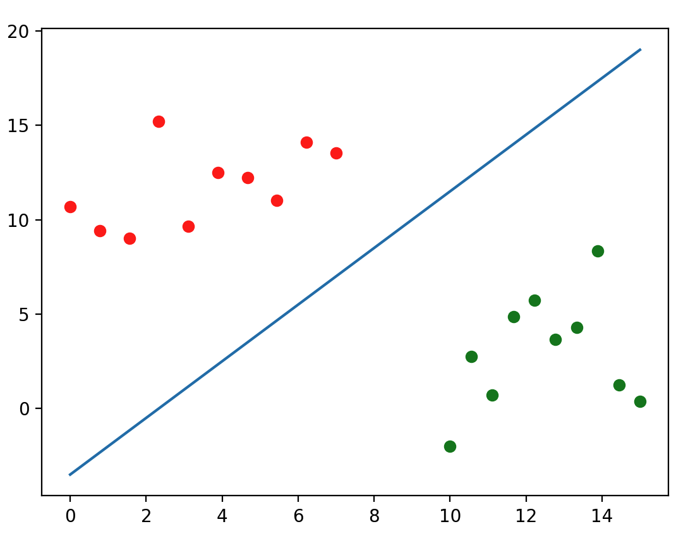
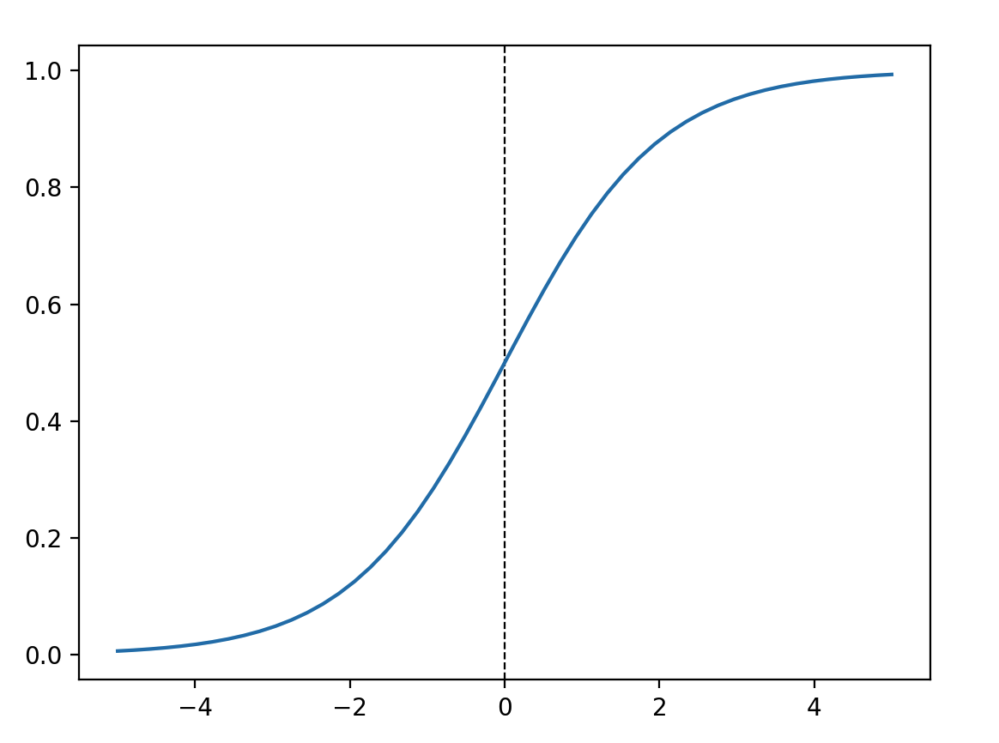

# Multilayer-perceptron

## Perceptron (simple neuron)

### Functions

#### Linear model function
$` z(x_1, x_2)=x_1*w_1 + x_2*w_2 + b `$  
Where :
- $x_1$ and $x_2$ are data passed to the fonction (from the data).  
- $w_1$ and $w_2$ are weights determined during the learning phase to make a parameter more important than an another
- $b$ the bias is also determined during the leanrning phase to make the program able to shift to the activation fonction [here](https://stackoverflow.com/questions/2480650/what-is-the-role-of-the-bias-in-neural-networks)  

The result of this function tell us on which side of the data we are (logistic regression).  
If it is positive we are on the right side of the fonction, if it is negative on the left side.  

#### Activation function
The activation function is used to convert the result of $z$ to a probability.  
There are multiple activations functions but in this case we use the [**sigmoide**](https://en.wikipedia.org/wiki/Sigmoid_function).  

$a(z)=\frac{1}{1+e^-z}$  

#### Log Loss function
The function to calculate likelihood of our model is represented by $L=\prod_{i=1}^m a_{i}^{a_y}*(1-a_i)^{1-y_i}$, it is the sum of your probabilities.  
The issue is that the number will tend towards 0 due to the multiplication of a number between [0, 1].  
To avoid this problem, we will use the $\log$ and use [logarithms](https://en.wikipedia.org/wiki/Logarithm) attributes.  
If apply the log, expand and simplify this function it will be $LL$

$LL=-\frac{1} {m}\sum_{i=1}^m y_i\log(a_i)+(1-y_i)\log(1-a_i)$

You might wonder what is the $-\frac{1}{m}$ it is because we can't maximise a function in maths. So instead of trying to maximise $L$ we are going to minimise $-L$, which is the same thing.  
The division by m is just there to do some normalization of our result.  

> [!IMPORTANT]
> This function $LL$ is called LogLoss.

> [!NOTE]
> Bernoulli distribution.

If we want to minimize our Log Loss function we can use the **gradient descent** algorithm.  
This involves to calculate the derivative of Log Loss.

> [!TIP]
> You should do a linear regression before starting this project.

### Derivated functions

#### Calculations
As the **chain rule** we can express:  
- $\frac{\partial{L}}{\partial{w_1}} = \frac{\partial{L}}{\partial{a}} * \frac{\partial{a}}{\partial{z}} * \frac{\partial{z}}{\partial{w_1}}$  
- $\frac{\partial{L}}{\partial{w_2}} = \frac{\partial{L}}{\partial{a}} * \frac{\partial{a}}{\partial{z}} * \frac{\partial{z}}{\partial{w_2}}$  
- $\frac{\partial{L}}{\partial{b}} = \frac{\partial{L}}{\partial{a}} * \frac{\partial{a}}{\partial{z}} * \frac{\partial{z}}{\partial{b}}$  

As you see this is the last derivative that is changing depending on the variable.  
We can calculate few derivatives:  
- $\frac{\partial{L}}{\partial{a}}=\frac{y}{a}-\frac{1-y}{1-a}$
- $\frac{\partial{a}}{\partial{z}}=\frac{e^{-z}}{(1+^{-z})^2}=\frac{1}{(1+e^{-z})}*\frac{e^{-z}}{(1+e^{-z})}=a(1-a)$
- $\frac{\partial{z}}{\partial{w_1}}=x_1$
- $\frac{\partial{z}}{\partial{w_2}}=x_2$
- $\frac{\partial{z}}{\partial{b}}=1$

If we combine everything together we obtain:  
- $\frac{\partial{L}}{\partial{w_1}}=\frac{1}{m}\sum_{i=1}^m(a_i-y_i)x_1$
- $\frac{\partial{L}}{\partial{w_2}}=\frac{1}{m}\sum_{i=1}^m(a_i-y_i)x_2$
- $\frac{\partial{L}}{\partial{b}}=\frac{1}{m}\sum_{i=1}^m(a_i-y_i)$  
Where $a_i$ is the value predicted for $i$, and $y_i$ the real one.  

#### Gradient
If we apply the gradient descent formula, then we have:  
- $w_1 = w_1 - \alpha\frac{\partial{L}}{\partial{w_1}}$  
- $w_2 = w_2 - \alpha\frac{\partial{L}}{\partial{w_2}}$  
- $b = b - \alpha\frac{\partial{L}}{\partial{b}}$  

<ins>Few links to understand some tips about derivative and maths :</ins>
- [Chain Rule](https://en.wikipedia.org/wiki/Chain_rule)
- [Derivative](https://en.wikipedia.org/wiki/Derivative)
- [List usuals derivatives](http://dossierslmm.chez-alice.fr/fiche/tableaux_derivees.pdf)

### Vectorisations
Once we calculated every function that we need for our perceptron we might think of how vectorize it.  
*Why you could tell me ?* Because it will simplificate our calculations.  
For the moment we need to treat every data in a "for loop" and iterate over each index. But it is long and it cost us a lot of computation.  
To avoid this problem can vectorize our functions and data to treat them at the same time.  

> [!NOTE]
> In fact this is faster because numpy implements vectorizations with the arrays object in C.  
> In raw python you'll have to iterate over each element using a for loop.  

> [!TIP]
> Vectorization is made by using [matrix](https://en.wikipedia.org/wiki/Matrix_(mathematics)).  

| Name | Vector(s) | Informations |
| - | - | - |
| dataset | $` X=\begin{bmatrix} x_1^{(1)} & \cdots & x_1^{(m)} \\ \vdots & \ddots & \vdots \\ x_n^{(1)} & \cdots & x_n^{(m)} \end{bmatrix} `$   $`Y=\begin{bmatrix} y_1 & \cdots & y_m\end{bmatrix}`$ | $X$ the dataset, $Y$ the expected output corresponding (used for validation). $m$ is the number of data **(entries)** and $n$ the number of variables **(features)**. |
| $z(x_1, x_2)$ | $`W=\begin{bmatrix} w_1 & \cdots & w_n\end{bmatrix}`$ and $`b=\begin{bmatrix} b & \cdots & b\end{bmatrix}`$     $Z=XW+b$ | $W$ the vector of each weights, $b$ for each *bias*. |
| $a(z)$ | $A=\frac{1}{1+e^{-Z}}$ | We just reuse of $Z$ matrix and applying to it the sigmoide function. |
| $LogLoss$ | $L=-\frac{1} {m}\sum_{i=1}^m Y\log(A)+(1-Y)\log(1-A)$ | Reuse of the previous matrixes. |
| gradients | $W = W - \alpha\frac{\partial{L}}{\partial{W}}$    $b = b - \alpha\frac{\partial{L}}{\partial{b}}$ | with $\frac{\partial{L}}{\partial{W}}=\frac{1}{m}X^T \cdot (A-y)$     with $\frac{\partial{L}}{\partial{b}}=\frac{1}{m}(A-y)$ |

> [!IMPORTANT]  
> You might wonder why do we use the transpose of the matrix? Have a look at this expression:  
>   
> $`\frac{\partial{L}}{\partial{W}}=\begin{bmatrix} \frac{\partial{L}}{\partial{w_1}} \\ \vdots \\ \frac{\partial{L}}{\partial{w_n}}\end{bmatrix}`$

> [!TIP]
> $A \odot B$ mean product term to term [Hadamard](https://en.wikipedia.org/wiki/Hadamard_product_(matrices)) and $A \cdot B$ or $AB$ mean matrix product.

## Multilayer perceptron
Once you conceptualize your single perceptron (neuron), you can have multiple of them. Indeed having multiples neurons can be helpful to solve non-linear problems.  
Our objective will be to construct layers of neurons that will pass informations to the next layer until they reach the last layer and have the output.  
This phase will be defined by the **forward progagation**, representing data going from left to right.  
Then we will need our model to learn, so depending on the output of our last layer. We will adapt each layer of our model to make it better.  
Well, the data will now pass from the right to left.
This is called the **backward propagation**.  
We already have computed the **learning process** of a neuron using the *gradient descent* is this [project](#log-loss-function).

> [!NOTE]
> We can remember the **backward propagation** is just applying LogLoss(aka cross-entropy function) to each neurons of a layer starting from the last layer to the first one.  

### Concept
Instead of treating each neuron calculation independently we can as we made before vectorize them.  
It will give us vectors of layers that will perfom all the calculation for a layer.
Let's try to generalize our formulas to C layers, then will be able to have custom models.  

*definitions:*  
- $n$ the number of neuron in a layer and for the first layer the number of features * 
- $m$ the number of entries in our dataset
- $c$ the number of layers in our dataset, we will also use it as an index to move between layer

> [!NOTE]
> Input layer is just a placeholder without "neurons".  
> So we do not include the input layer in the count of layers, it's implicit. 

#### A layer
To create a layer we will expand our existing vectors to have multiples neurons inside of them.  
| $1$ neuron | $x$ neurons |
|-|-|
| $`W=\begin{bmatrix} w_{1} & \cdots & w_n\end{bmatrix} `$ | $`W=\begin{bmatrix} w_{11} & \cdots & w_{1n} \\ \vdots & \ddots & \vdots \\ w_{x1} & \cdots & w_{xn} \end{bmatrix} `$ |
| $`b=\begin{bmatrix} b & \cdots & b\end{bmatrix} `$ | $`b=\begin{bmatrix} b_{1} & \cdots & b_{1n} \\ \vdots & \ddots & \vdots \\ b_{x} & \cdots & b_{xn}  \end{bmatrix} `$ |
| $`Z=\begin{bmatrix} z_1 \\ \vdots \\ z_m \end{bmatrix} `$ | $`Z=\begin{bmatrix} z_{1}^{1} & \cdots & z_{1}^{x} \\ \vdots & \ddots & \vdots \\ z_{n}^1 & \cdots & z_{n}^x  \end{bmatrix} `$ |
  

#### Two Layers
As I said before, when we talk about two layers we mean an input layer, 2 hidden layers and an output layer.  

##### Forward propagation
$Z^{[1]}=W^{[1]}\cdot X +b^{[1]}$  
$A^{[1]}=\frac{1}{1+e^{-Z^{[1]}}}$  
$Z^{[2]}=W^{[2]}\cdot A^{[1]} +b^{[2]}$  
$A^{[2]}=\frac{1}{1+e^{-Z^{[2]}}}$  

You feel that is this not well complicated you just pass data *to the right*.  

##### Backward propagation
For the backward propagation we just need to compute our differents gradient using the partials derivatives of the *LogLoss* function.  

- $dZ2 = (A^{[2]}-y)$
- $\frac{\partial{L}}{\partial{W^{[2]}}}=\frac{1}{m}dZ2 \cdot A^{[1]^{T}}$
- $\frac{\partial{L}}{\partial{b^{[2]}}}=\frac{1}{m}\sum{dZ2}$
- $dZ1 = W^{[2]^{T}} \cdot dZ2 \odot A^{[1]}(1-A^{[1]})$
- $\frac{\partial{L}}{\partial{W^{[1]}}}=\frac{1}{m}dZ1 \cdot X^{T}$
- $\frac{\partial{L}}{\partial{b^{[1]}}}=\frac{1}{m}\sum{dZ1}$

> [!NOTE]
> Why do we declare $dZ2$? It's because if you expand the formula it's something in common between the differents derivatives.  
> Also the final layer is a little bit different because it compare to the real expected output instead comparing to a layer output.  

#### Extension to $C$ layers

##### Forward propagation

$Z^{[c]}=W^{[c]}\cdot A^{[c-1]} +b^{[c]}$  with  $X=A^{[0]}$  
$A^{[c]}=\frac{1}{1+e^{-Z^{[c]}}}$  

##### Backward propagation

$dZ^{[Cf]}= A^{[Cf]} - y$  where $Cf$ is the last layer (output)  
$dZ^{[c-1]}=W^{[c]^{T}} \cdot dZ^{[c]} \odot A^{[c-1]}(1-A^{[c-1]})$ where the right part is the derivate of $A$, here the sigmoide function  

  
$dW^{[c]}= \frac{1}{m} dZ^{[c]} \cdot A^{[c-1]^{T}}$  
$db^{[c]}=\frac{1}{m}\sum{dZ^{[c]}}$  

##### Final matrix dimensions (helpful)
$X\in\mathbb{R}^{n^{[0]}*m}$  
$Y\in\mathbb{R}^{1*m}$  
$W^{[c]}\in\mathbb{R}^{n^{[c]}*n^{[c-1]}}$  
$b^{[c]}\in\mathbb{R}^{n^{[c]}*1}$  
$A^{[c]},Z^{[c]}\in\mathbb{R}^{n^{[c]}*m}$  

## Next

### Mini batch / Batch
This technique is used divide the epoch in training on differents part of the dataset determined by a *batch size*.  

### Statistics
The accuracy and loss on the training/validation phase help us determine when the model is ready.  

### Preprocessing
For preparing our data where using the **z-score** standardization but there are many others techniques like **min-max** normalization.  

## Resources
- [Google ML](https://developers.google.com/machine-learning/crash-course?hl=fr)
- [Optimizers](https://www.youtube.com/watch?v=NE88eqLngkg)
- [Perceptron Concept & Maths explanations](https://www.youtube.com/@MachineLearnia)
- [Early Stopping](https://en.wikipedia.org/wiki/Early_stopping)

#### See also
- [Cross Validation](https://fr.wikipedia.org/wiki/Validation_crois%C3%A9e)
- [Kfold Validation](https://www.datacamp.com/fr/tutorial/k-fold-cross-validation)
- [Box plot](https://en.wikipedia.org/wiki/Box_plot)
- [PCA](https://en.wikipedia.org/wiki/Principal_component_analysis)

adam optimizer

refaire les explications pour la dérivée dZ qui vaut A - Y pour bce et cee

tester si le fichier est vide